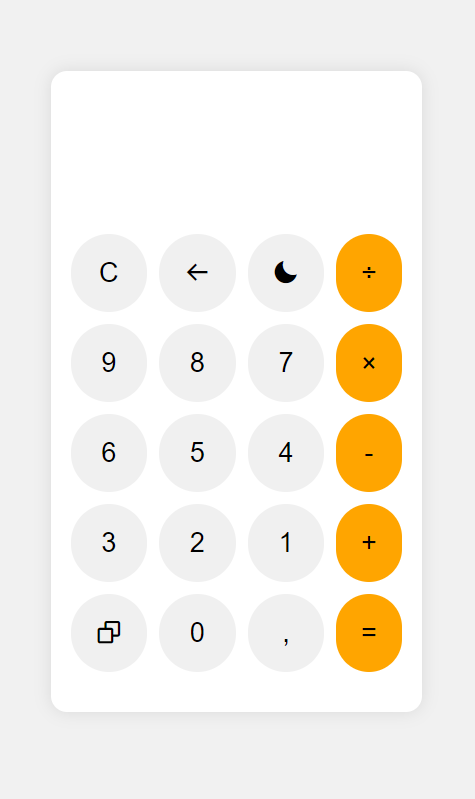
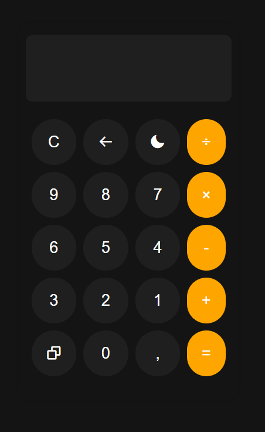

# Calculadora Simples 🔢

Uma calculadora simples implementada em HTML, CSS e JavaScript.

## Funcionalidades 📝

- Realizar cálculos matemáticos básicos.
- Alternar entre o modo claro e escuro.
- Copiar o resultado para a área de transferência.

## Como usar 🔧

1. Abra o arquivo `index.html` em um navegador web.
2. Utilize os botões digitais ou o teclado para realizar os cálculos númericos.
3. Clique no botão "Calcular" ou pressione Enter para obter o resultado.
4. Clique no botão "🌙" para alternar entre o modo claro e escuro.
5. Clique no botão "📋" para copiar o resultado para a área de transferência.

## Screenshots do projeto 📸

    
    

## Autor ✒️

- [Brayan](<https://github.com/brayan-tb>) 👨‍💻